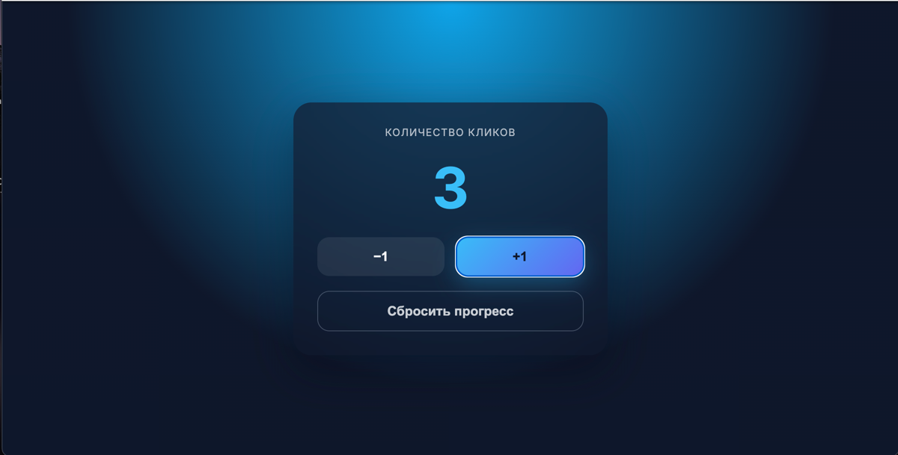
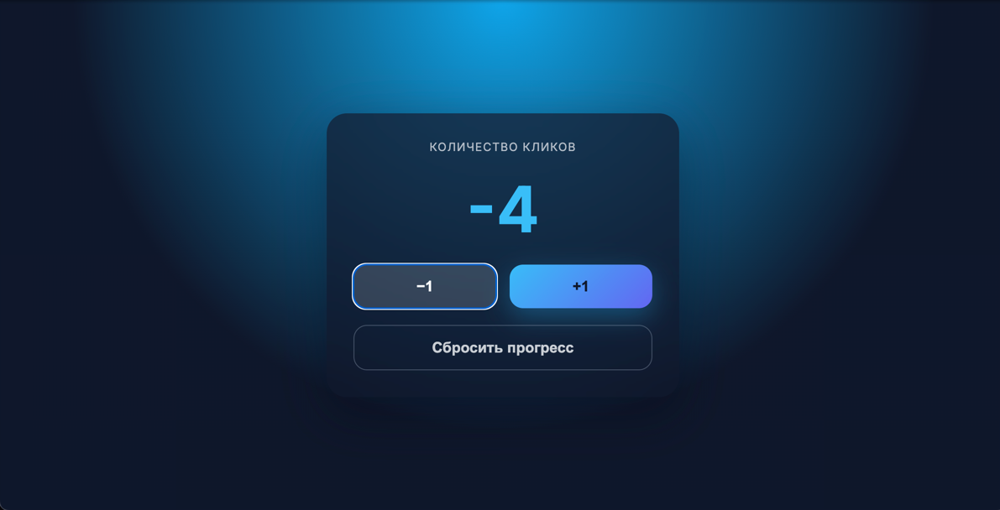
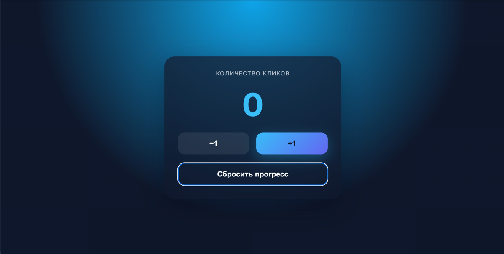

В моем проекте реализован счетчик кликов с небольшим дизайном
Функциональность довольно простая, можно либо прибавлять, либо уменьшать, а так же можно сбросить весь прогресс. 
Ниже представлен скришоты результата выполнения программы.
 
https://github.com/PavelFarniev/untitled7